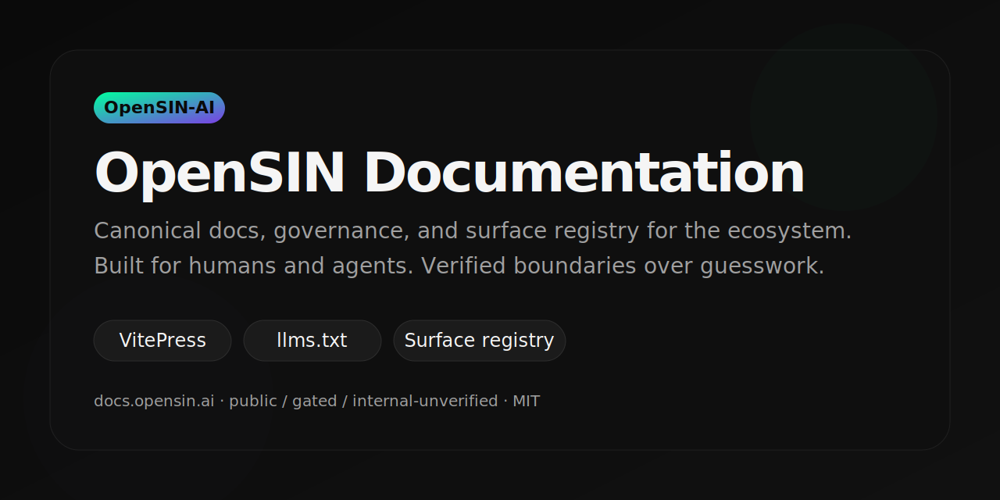
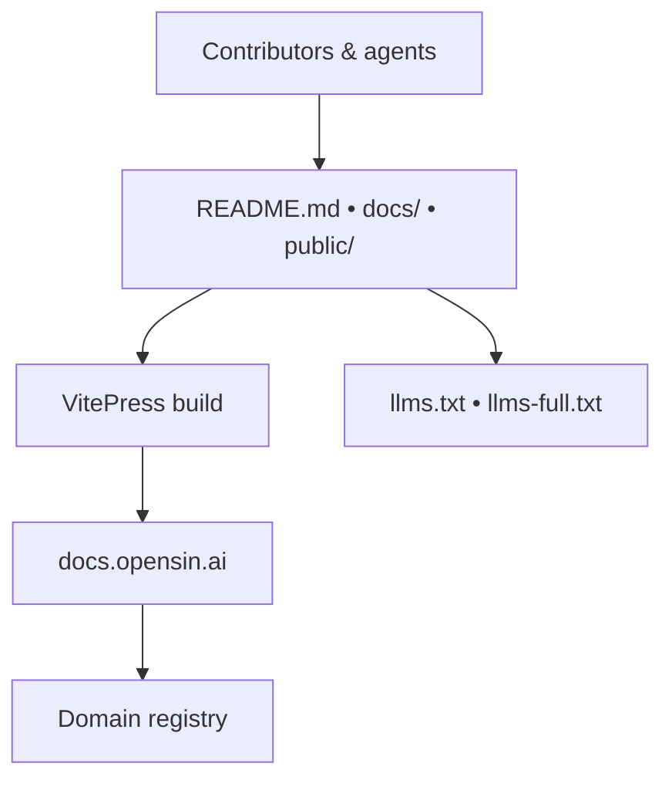

<a name="readme-top"></a>

# OpenSIN Documentation

<p align="center">
  <a href="https://github.com/OpenSIN-AI/OpenSIN-documentation/actions/workflows/docs.yml">
    
  </a>
  <a href="https://github.com/OpenSIN-AI/OpenSIN-documentation/blob/main/LICENSE">
    
  </a>
  <a href="https://vitepress.dev/">
    
  </a>
  <a href="https://bun.sh/">
    
  </a>
  <a href="./llms.txt">
    
  </a>
  <a href="docs/governance/domain-registry.md">
    
  </a>
</p>

<p align="center">
  <a href="#quick-start">Quick Start</a> ·
  <a href="#at-a-glance">At a glance</a> ·
  <a href="#documentation-map">Documentation map</a> ·
  <a href="#surface-registry">Surface registry</a> ·
  <a href="#architecture">Architecture</a> ·
  <a href="#ai-discoverability">AI discoverability</a> ·
  <a href="#contributing">Contributing</a> ·
  <a href="#license">License</a>
</p>

<p align="center">
  
</p>

> Canonical docs, governance, and surface registry for the OpenSIN-AI ecosystem.
>
> *Built for humans and agents: one source for verified public surfaces, gated experiences, and internal references.*

> [!IMPORTANT]
> This repository documents evidence-based surfaces. If a host or route is not explicitly verified, treat it as internal or unverified until the registry says otherwise.

## What this repo is

OpenSIN Documentation powers `docs.opensin.ai` and keeps the ecosystem canonical, searchable, and AI-discoverable. It is the place for guides, architecture notes, API references, governance docs, and live surface status.

<p align="right">(<a href="#readme-top">back to top</a>)</p>

## Quick Start

```bash
git clone https://github.com/OpenSIN-AI/OpenSIN-documentation.git
cd OpenSIN-documentation
bun install
bun run docs:dev
```

<details>
<summary>Build check</summary>

```bash
node node_modules/vitepress/bin/vitepress.js build docs
```

</details>

<p align="right">(<a href="#readme-top">back to top</a>)</p>

## At a glance

| Item | Value |
|:---|:---|
| Repo type | Documentation site / knowledge base |
| Stack | VitePress + Bun |
| Deployment | Cloudflare Pages |
| Canonical site | https://docs.opensin.ai |
| AI discovery | `llms.txt`, `llms-full.txt`, public mirrors |
| Registry | [Domain Registry](docs/governance/domain-registry.md) |

<p align="right">(<a href="#readme-top">back to top</a>)</p>

## Documentation map

| Area | Purpose | Entry point |
|:---|:---|:---|
| Guide | Onboarding, installation, and day-one usage | [docs/guide/getting-started.md](docs/guide/getting-started.md) |
| Architecture | System design, control planes, and trust boundaries | [docs/architecture/overview.md](docs/architecture/overview.md) |
| API | Endpoint references and protocol notes | [docs/api/overview.md](docs/api/overview.md) |
| Governance | Rules, registry, and handoff playbooks | [docs/governance/overview.md](docs/governance/overview.md) |
| Best Practices | Security, performance, SEO, and reliability patterns | [docs/best-practices/index.md](docs/best-practices/index.md) |
| Tutorials | Step-by-step workflows for contributors | [docs/tutorials/first-agent.md](docs/tutorials/first-agent.md) |
| Examples | Copy-pasteable implementation examples | [docs/examples/hello-world.md](docs/examples/hello-world.md) |
| Bridges | Web, desktop, and channel integrations | [docs/bridges/index.md](docs/bridges/index.md) |

<p align="right">(<a href="#readme-top">back to top</a>)</p>

## Surface registry

| Surface | Status | Notes |
|:---|:---|:---|
| `opensin.ai` | Public | Main marketing surface |
| `my.opensin.ai` | Public | Marketplace / subscription surface |
| `blog.opensin.ai` | Public | Blog and updates |
| `docs.opensin.ai` | Public | This documentation site |
| `chat.opensin.ai` | Gated | Login required; do not treat as open public |
| `api.opensin.ai` | Internal / unverified | Not publicly reachable in current checks |
| `opensin.ai/agents` | Internal / unverified | 404 in public checks |

See the full evidence ledger in [docs/governance/domain-registry.md](docs/governance/domain-registry.md).

<p align="right">(<a href="#readme-top">back to top</a>)</p>

## Architecture



The repo is intentionally split between human-readable docs and machine-readable discovery files so both people and agents can navigate it quickly.

<p align="right">(<a href="#readme-top">back to top</a>)</p>

## AI discoverability

- Root files: `llms.txt` and `llms-full.txt`
- Site mirrors: `public/llms.txt` and `public/llms-full.txt`
- Metadata: VitePress head tags and social preview assets
- Rule: update discovery files whenever the docs map or surface registry changes

<p align="right">(<a href="#readme-top">back to top</a>)</p>

## Contributing

- Read [CONTRIBUTING.md](CONTRIBUTING.md), [SUPPORT.md](SUPPORT.md), and [CODE_OF_CONDUCT.md](CODE_OF_CONDUCT.md) before opening a PR.
- Keep claims evidence-based and scoped to documentation canon.
- Update the registry first when a surface status changes.
- Validate with `node node_modules/vitepress/bin/vitepress.js build docs` before handing off.

<p align="right">(<a href="#readme-top">back to top</a>)</p>

## Security

- Read [SECURITY.md](SECURITY.md) for the reporting path.
- Never commit secrets, tokens, or private screenshots that expose credentials.
- If a route or host is sensitive, classify it as gated or internal instead of advertising it publicly.

<p align="right">(<a href="#readme-top">back to top</a>)</p>

## License

Distributed under the [MIT License](LICENSE).

<p align="right">(<a href="#readme-top">back to top</a>)</p>

---

<p align="center">
  <a href="https://opensin.ai">
    
  </a>
</p>

<p align="center">
  <sub>Public surfaces: <a href="https://opensin.ai">opensin.ai</a> · <a href="https://my.opensin.ai">my.opensin.ai</a> · <a href="https://blog.opensin.ai">blog.opensin.ai</a> · <a href="https://docs.opensin.ai">docs.opensin.ai</a></sub><br/>
  <sub>Gated: <a href="https://chat.opensin.ai">chat.opensin.ai</a></sub><br/>
  <sub><a href="https://docs.opensin.ai/governance/domain-registry">Surface registry</a> keeps the public/internal boundary honest.</sub>
</p>
