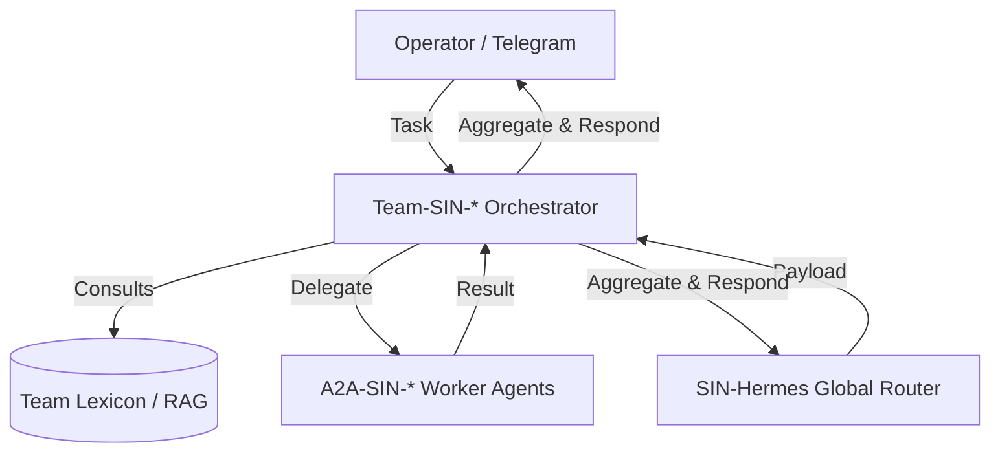

# A2A Protocol Architecture

The Agent-to-Agent (A2A) protocol is the communication backbone of the OpenSIN ecosystem. It enables autonomous agents to discover, authenticate, and collaborate without human intervention.

## Protocol Overview

A2A is a JSON-RPC 2.0 based protocol that runs over HTTP/HTTPS. Every agent exposes a standardized set of endpoints that allow other agents to:

- **Discover** capabilities via agent cards
- **Authenticate** using mutual TLS or token-based auth
- **Delegate** tasks with structured input/output contracts
- **Stream** results in real-time via Server-Sent Events

```
┌──────────────┐     JSON-RPC 2.0      ┌──────────────┐
│   Agent A    │ ───────────────────>   │   Agent B    │
│              │                        │              │
│ /.well-known │     Task Delegation    │ /a2a/v1      │
│ /agent-card  │ <───────────────────   │ /rpc         │
│ .json        │     Result Stream      │              │
└──────────────┘                        └──────────────┘
```

## Agent Card

Every A2A agent publishes a machine-readable agent card at `/.well-known/agent-card.json`:

```json
{
  "name": "SIN-Hermes",
  "version": "1.0.0",
  "description": "Task dispatcher and router for the SIN fleet",
  "url": "https://hermes.opensin.ai",
  "capabilities": {
    "streaming": true,
    "pushNotifications": false,
    "stateTransitionHistory": true
  },
  "skills": [
    {
      "id": "dispatch",
      "name": "Task Dispatch",
      "description": "Route tasks to the optimal agent"
    }
  ],
  "authentication": {
    "schemes": ["bearer"]
  }
}
```

## Task Lifecycle

A task progresses through well-defined states:

```
submitted → working → [input-required] → completed
                  └─→ failed
                  └─→ cancelled
```

### 1. Task Submission

```json
{
  "jsonrpc": "2.0",
  "method": "tasks/send",
  "params": {
    "id": "task-uuid-001",
    "message": {
      "role": "user",
      "parts": [
        { "type": "text", "text": "Analyze the security of this codebase" }
      ]
    }
  }
}
```

### 2. Task Streaming

For long-running tasks, agents use `tasks/sendSubscribe` to stream incremental updates:

```json
{
  "jsonrpc": "2.0",
  "method": "tasks/sendSubscribe",
  "params": {
    "id": "task-uuid-001",
    "message": {
      "role": "user",
      "parts": [{ "type": "text", "text": "Run full test suite" }]
    }
  }
}
```

The server responds with SSE events containing task status updates and partial results.

### 3. Artifact Exchange

Agents exchange structured artifacts (files, data, reports) as part of task results:

```json
{
  "type": "artifact",
  "artifact": {
    "name": "security-report.md",
    "parts": [
      { "type": "text", "text": "## Security Analysis\n..." }
    ]
  }
}
```

## Fleet Topology

The OpenSIN A2A fleet uses a hub-and-spoke model:

```
                    ┌────────────────┐
                    │   SIN-Zeus     │
                    │  (Orchestrator)│
                    └───────┬────────┘
                            │
            ┌───────────────┼───────────────┐
            │               │               │
     ┌──────┴──────┐ ┌──────┴──────┐ ┌──────┴──────┐
     │ SIN-Hermes  │ │ SIN-Herakles│ │ SIN-Solver  │
     │ (Dispatcher)│ │ (Backend)   │ │ (Web App)   │
     └─────────────┘ └─────────────┘ └─────────────┘
```

- **SIN-Zeus**: Top-level orchestrator, decides which agents handle which tasks
- **SIN-Hermes**: Dispatcher that routes tasks and monitors fleet health
- **SIN-Herakles**: Backend/infrastructure agent for heavy lifting
- **SIN-Solver**: Web application agent for user-facing features

## MCP Integration

Each A2A agent also exposes an MCP (Model Context Protocol) server, allowing LLM-based tools to invoke agent capabilities directly:

```json
{
  "mcpServers": {
    "sin-hermes": {
      "command": "node",
      "args": ["dist/src/cli.js", "serve-mcp"],
      "env": {
        "A2A_TOKEN": "${A2A_TOKEN}"
      }
    }
  }
}
```

## Security Model

- **Authentication**: Bearer tokens (JWT) or mutual TLS
- **Authorization**: Role-based access control per skill
- **Transport**: HTTPS required in production
- **Rate Limiting**: Per-agent configurable limits
- **Audit Trail**: All task interactions logged to Supabase

## Creating an A2A Agent

See the [Custom Agents Tutorial](/tutorials/custom-agents) for a step-by-step guide, or use the template:

```bash
gh repo create OpenSIN-AI/A2A-SIN-MyAgent \
  --template OpenSIN-AI/Template-A2A-SIN-Agent \
  --public
```

## 🔄 The New Fleet Topology (Hub & Spoke)

As defined in the `OpenSIN-overview` SSOT, the OpenSIN A2A fleet uses a strict **Hub & Spoke** model to prevent N^2 communication chaos.



**Key Rules:**
1. **Workers are Silent:** `A2A-SIN-*` worker agents NEVER communicate with workers from other teams. They only accept tasks from their designated `Team-SIN-*` manager.
2. **Team Managers Orchestrate:** Only `Team-SIN-*` agents possess the `TELEGRAM_BOT_TOKEN` to communicate with humans.

---

## Relevante Mandate

| Mandat | Priority | Regel |
|--------|----------|-------|
| **A2A-First** | -200.0 | SELBST MACHEN via A2A-Agenten |
| **n8n OSS Only** | 0.0 | KEINE n8n Premium Features |
| **Self-Hosted Supabase** | 0.0 | OCI VM — KEINE Supabase Cloud |

→ [Alle Mandate](/best-practices/a2a-communication)
