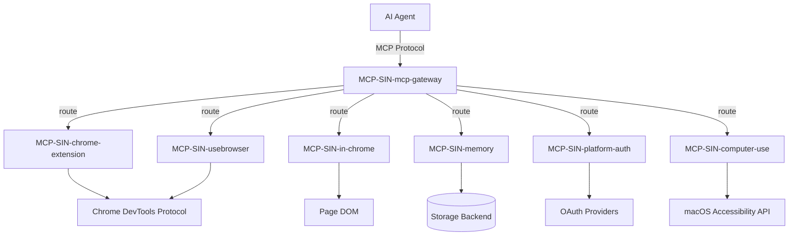

# 🚨 MCP Server Documentation Audit

**Issue:** [#96](https://github.com/OpenSIN-AI/OpenSIN-documentation/issues/96)
**Date:** 2026-04-14
**Severity:** CRITICAL
**Status:** In Progress

---

## Executive Summary

**7 MCP servers** in the OpenSIN-AI organization have **zero documentation** — no README.md, no AGENTS.md. These are the infrastructure backbone of the entire AI agent ecosystem. Without documentation, no agent can discover, connect to, or debug these services.

---

## Audit Table

| #   | MCP Server               | README | AGENTS.md | Purpose                                        | Priority |
| --- | ------------------------ | ------ | --------- | ---------------------------------------------- | -------- |
| 1   | MCP-SIN-chrome-extension | ❌     | ❌        | Chrome Extension bridge for browser automation | CRITICAL |
| 2   | MCP-SIN-computer-use     | ❌     | ❌        | Desktop screen control and automation          | CRITICAL |
| 3   | MCP-SIN-mcp-gateway      | ❌     | ❌        | Multi-MCP server routing gateway               | CRITICAL |
| 4   | MCP-SIN-in-chrome        | ❌     | ❌        | MCP running inside Chrome browser context      | CRITICAL |
| 5   | MCP-SIN-memory           | ❌     | ❌        | Persistent memory/context storage              | CRITICAL |
| 6   | MCP-SIN-platform-auth    | ❌     | ❌        | Platform authentication bridge                 | CRITICAL |
| 7   | MCP-SIN-usebrowser       | ❌     | ❌        | Browser automation wrapper (nodriver/CDP)      | CRITICAL |

---

## README Template Structure

Each MCP server README must follow this canonical structure:

````markdown
# MCP-SIN-[name]

> [One-line description]

## Overview

[What it does, why it matters, where it fits in the OpenSIN ecosystem]

## Installation

```bash
# Clone and install
git clone https://github.com/OpenSIN-AI/MCP-SIN-[name].git
cd MCP-SIN-[name]
bun install

# Build
bun run build
```
````

## Available Tools

| Tool        | Parameters    | Description  |
| ----------- | ------------- | ------------ |
| `tool_name` | `param: type` | What it does |

## Connection Guide

### stdio Mode (Default)

[How to connect via stdio]

### streamable-http Mode

[How to connect via HTTP]

## Health Check

```bash
curl http://localhost:PORT/health
```

## Example Usage

[Working code example]

## Troubleshooting

[Common issues and solutions]

````

---

## Remediation Steps

### Step 1: Create README.md for each MCP server
Use the template structure above, filling in server-specific details.

### Step 2: Create AGENTS.md for each MCP server
See [agents-mandate-audit.md](./agents-mandate-audit.md) for complete AGENTS.md drafts.

### Step 3: Add GitHub Topics
```bash
gh repo edit OpenSIN-AI/MCP-SIN-[name] --add-topic "opnsin-mcp"
````

### Step 4: Verify

- [ ] README.md renders correctly on GitHub
- [ ] MCP server can be started with documented commands
- [ ] Health check returns 200
- [ ] At least one tool call works end-to-end

---

## Reference Architecture



All 7 MCP servers form the **OpenSIN Infrastructure Layer** — the bridge between AI agents and the external world (browser, desktop, memory, authentication).

---

## Relevante Mandate

| Mandat                  | Priority | Regel                               |
| ----------------------- | -------- | ----------------------------------- |
| **Bun-Only**            | -1.5     | `bun install` / `bun run` statt npm |
| **Annahmen-Verbot**     | -5.0     | KEINE Diagnose ohne Beweis          |
| **Test-Beweis-Pflicht** | 0.0      | KEIN "Done" ohne echten Test-Lauf   |

→ [Alle Mandate](/best-practices/code-quality)
