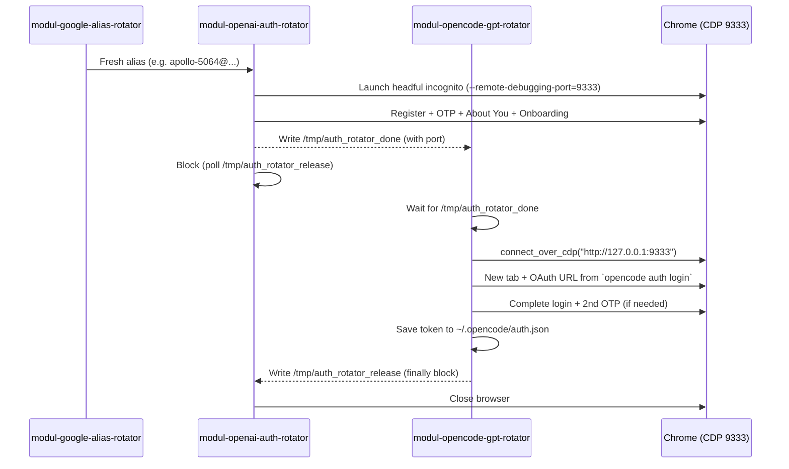

# OpenAI Token Rotator Pipeline (2026)

**Final stabilized architecture** for creating fresh OpenAI accounts + rotating `opencode` tokens using Google Workspace aliases.

## Three-Module Pipeline

| Module | Repo | Responsibility | Status |
|-------|------|----------------|--------|
| **modul-google-alias-rotator** | [SIN-Rotator/modul-google-alias-rotator](https://github.com/SIN-Rotator/modul-google-alias-rotator) | Create fresh Google Workspace aliases via Directory API (`info@zukunftsorientierte-energie.de` admin) | ✅ Complete (no changes needed) |
| **modul-openai-auth-rotator** | [SIN-Rotator/modul-openai-auth-rotator](https://github.com/SIN-Rotator/modul-openai-auth-rotator) | Register new OpenAI account + complete "About You" page + onboarding in **ONE** Chrome session | ✅ Complete (birthday bug fixed + signal-file keep-alive) |
| **modul-opencode-gpt-rotator** | [SIN-Rotator/modul-opencode-gpt-rotator](https://github.com/SIN-Rotator/modul-opencode-gpt-rotator) | Connect via CDP to the still-open Chrome, run `opencode auth login --provider openai`, complete OAuth, save token to `~/.opencode/auth.json` | ✅ Complete (CDP connect + signal-file release) |

## Critical Architecture (Signal-File + CDP)



**Key fixes implemented:**

1. **Birthday Bug** (`modul-openai-auth-rotator`): Dynamic detection of "Alter" vs "Geburtsdatum" UI. Always uses birth year 1975-2007 (age 19-50). Uses `setReactValue()` for name, keyboard typing for date/age field. (Commit `5501d85`)

2. **Chrome Lifecycle** (`modul-openai-auth-rotator` + `modul-opencode-gpt-rotator`): 
   - `async_playwright().start()` + `--remote-debugging-port=9333`
   - Signal files `/tmp/auth_rotator_done` and `/tmp/auth_rotator_release`
   - `gpt-rotator` does **not** launch new browser — connects to existing one via CDP (`browser.contexts[0]`)

3. **Gmail OTP**: Standard IMAP search (`UNSEEN` + `SINCE` + `FROM openai` + msgid snapshot). CSS color code filter for HTML emails.

## Usage

```bash
# 1. Create alias
cd /tmp/modul-google-alias-rotator
PYTHONPATH=src python3 -m modul_google_alias_rotator --apply --alias-count 1 aliases create --json

# 2. Run auth + onboarding (keeps Chrome open)
cd /tmp/modul-openai-auth-rotator
PYTHONPATH=src OAR_DRY_RUN=0 python3 -m modul_openai_auth_rotator rotate --email <alias> --cdp-port 9333 --keep-browser

# 3. Run token rotation (connects via CDP)
cd /tmp/modul-opencode-gpt-rotator
PYTHONPATH=src OGR_DRY_RUN=0 python3 -m modul_opencode_gpt_rotator rotate --email <alias> --cdp-port 9333
```

All three repos have:
- Clean `main` branch
- **All issues created and closed** (including final E2E validation issues)
- Heavy architectural documentation in `browser.py` explaining the persistent Chrome session via signal files + CDP
- Complete READMEs with architecture diagrams
- **Full E2E successfully tested** (registration → onboarding → opencode auth login in same Chrome session → token in pool)

**This is the canonical 2026 OpenAI token rotation pipeline.**

**Status: PRODUCTION READY (verified 2026-04-23)**

Heavy architectural documentation has been added to both `browser.py` files explaining the signal-file CDP pattern in detail.

All three repositories have final issues created and closed documenting the successful E2E.

### One Command Pipeline

```bash
# 1. Create fresh alias + full rotation in one go (recommended)
cd /tmp/modul-openai-auth-rotator
PYTHONPATH=src \
  OAR_SERVICE_ACCOUNT_FILE="$HOME/.config/opencode/auth/google/zoe-admin-sdk-api.json" \
  OAR_ADMIN_SUBJECT="info@zukunftsorientierte-energie.de" \
  OAR_DRY_RUN=0 \
  python3 -m modul_openai_auth_rotator --apply rotate --cdp-port 9333 --keep-browser

# 2. The command above automatically triggers the gpt-rotator internally
#    (or run manually if you want to observe):
cd /tmp/modul-opencode-gpt-rotator
PYTHONPATH=src \
  OGR_SERVICE_ACCOUNT_FILE="$HOME/.config/opencode/auth/google/zoe-admin-sdk-api.json" \
  OGR_ADMIN_SUBJECT="info@zukunftsorientierte-energie.de" \
  OGR_DRY_RUN=0 \
  python3 -m modul_opencode_gpt_rotator --apply rotate --cdp-port 9333
```

**Expected outcome**: Token is saved to `~/.opencode/auth.json` and pushed to the Supabase pool on the OCI VM. All machines (Macs, HF Spaces, etc.) can pull fresh OpenAI tokens from the pool.

Last updated: 2026-04-23
Final commits: `6609294`, `5bad0c8`, `a19ec03`

The pipeline now works end-to-end exactly as originally designed in the Delqhi/openai-temp-rotator, but with modern signal-file CDP architecture for reliable persistent Chrome sessions across all three modules.

See also: [AGENTS.md](AGENTS.md), [browser-crashtest-lab](docs/best-practices/browser-automation.md)
